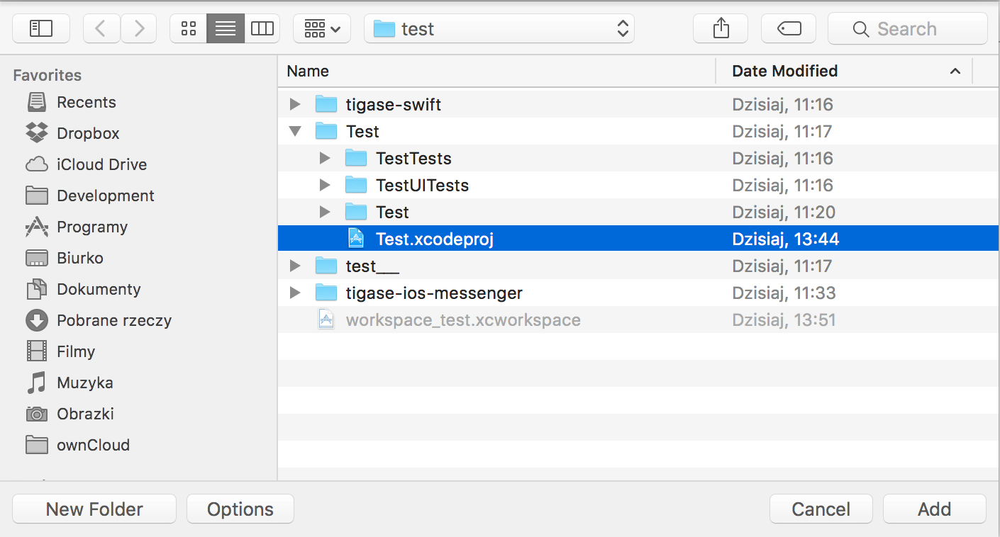

Starting up
============

Preparation of environment for development
---------------------------------------------

1. Download and install newest version of XCode

2. Download source code of library

   It is best to download library source code from our Git repository

3. Create workspace in XCode

4. Add library project to newly created workspace using ``Add Files to "workspace_name"…​`` from ``File`` menu of XCode when workspace is opened in XCode.

   |AddFilesTo|

5. Select ``TigaseSwift.xcodeproj`` which wil be inside root directory of source code of library and click ``Add``

   |SelectTigaseSwiftLibrary|

6. Workspace for development using TigaseSwift library is ready

Creation of project using TigaseSwift library
------------------------------------------------

1. Create project in XCode

2. Add project to TigaseSwift library workspace created during preparation of environment for development using @Add Files to "workspace_name"…​@ from @File@ menu of XCode when workspace is opened in XCode.

   |AddFilesTo|

3. Select XCode project file of your newly created project and click ``Add``

   This file name will end with ``.xcodeproj``

   |SelectNewProject|

4. In XCode open ``Build Settings`` tab of imported project

5. In section ``Embedded Binaries`` click on ``+`` sign

6. Select ``TigaseSwift.framework`` and add it to project

   It will be located in ``Products`` folder of ``TigaseSwift`` project |AddTigaseSwiftAsEmbeddedFramework|

7. Your project contains embedded ``TigaseSwift`` framework

.. |AddFilesTo| image:: ../asciidoc/images/AddFilesTo.png
.. |SelectTigaseSwiftLibrary| image:: ../asciidoc/images/SelectTigaseSwiftLibrary.png

.. |AddTigaseSwiftAsEmbeddedFramework| image:: ../asciidoc/images/AddTigaseSwiftAsEmbeddedFramework.png

